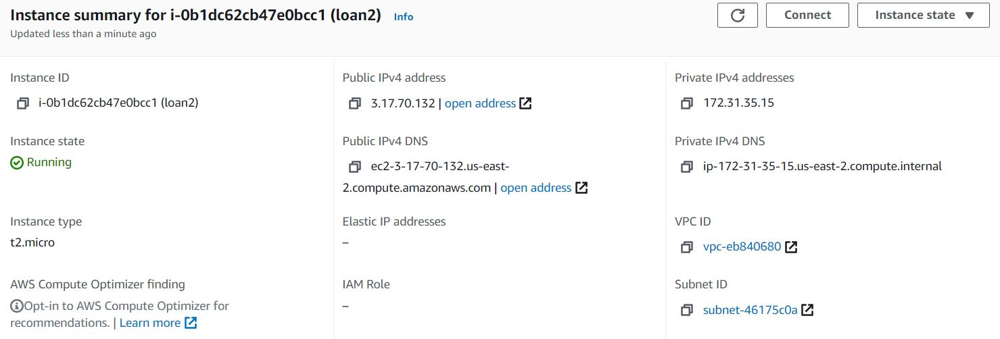
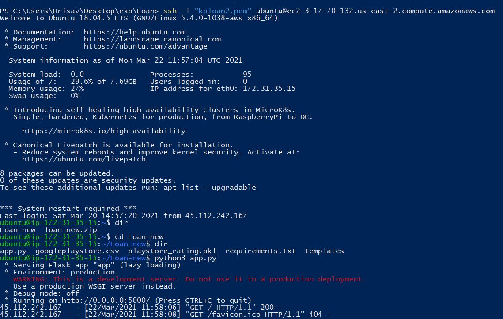
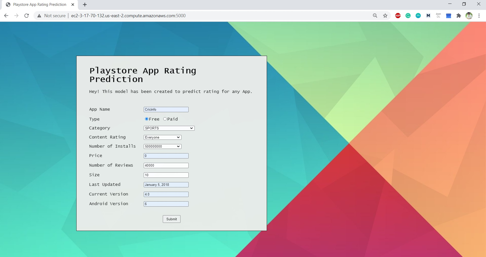
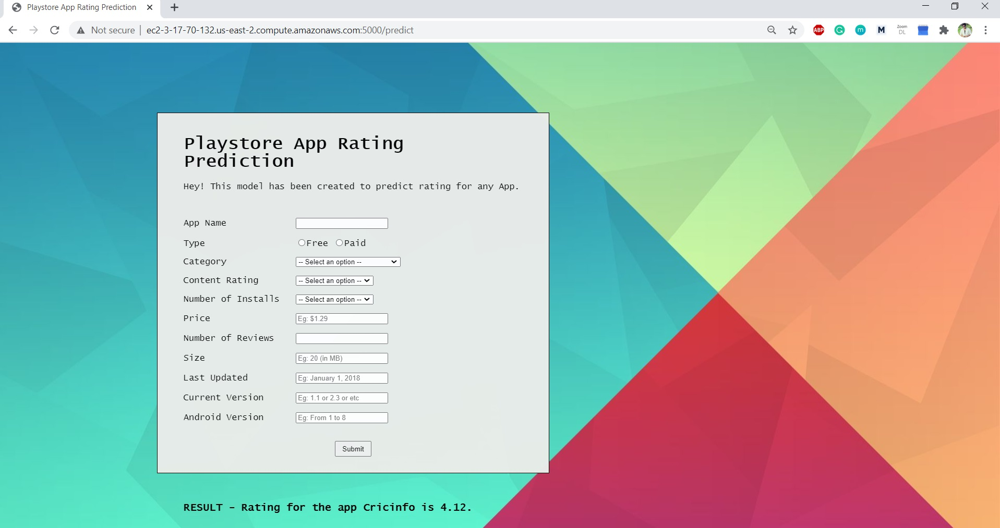

# Google Playstore Apps Rating Prediction

Overview
-

This is a playstore app rating prediction Flask app. The motive during the project was to analyze the data and provide insights regarding them, which would in turn help the android developers to understand the factors behind the ratings of any app. The ultimate objective was to predict the ratings of the new android apps.

Files
-

- googleplaystore.csv (dataset)
- Play_Store_Apps_Rating.ipynb (notebook file with EDA, Tests, etc)
- rating.py (python file for model building)
- playstore_rating.pkl (pickle file consisting the model)
- app.py (python file for model deployment)
- requirements.txt (necessary libraries)
- templates/index.html (html file for frontend)

How to run
-

- Open the project in an editor
- Using the command install all libraries -> "pip install -r requirements.txt"
- Uncomment the code in app.py -> app.run(debug=True)
- Comment the code in app.py -> app.run(host="0.0.0.0")
- Run the app.py file

Algorithms
-

We tried to perform model building using Random Forest, Support Vector Regressor. Also we tried to find out the best result by applying Randomized Search cross validation. We got the best RMSE score when we applied Random Forest with cross validation. So we went ahead with this algorithm for predicting the rating for new android apps.

Deployment on AWS EC2
-

- Create an instance, generate PEM file.
- Push code to AWS server using FileZilla.
- Add source 0.0.0.0/0 with port 5000 in EC2.
- Connect to server using Powershell and run app.py file.
- Run the link on browser (http://ec2-3-17-70-132.us-east-2.compute.amazonaws.com:5000/) to work on the model.

Output
-

UI was built and we will have to put in details for any app whose rating we would like to predict. Here we have filled in with details of Cricinfo.

